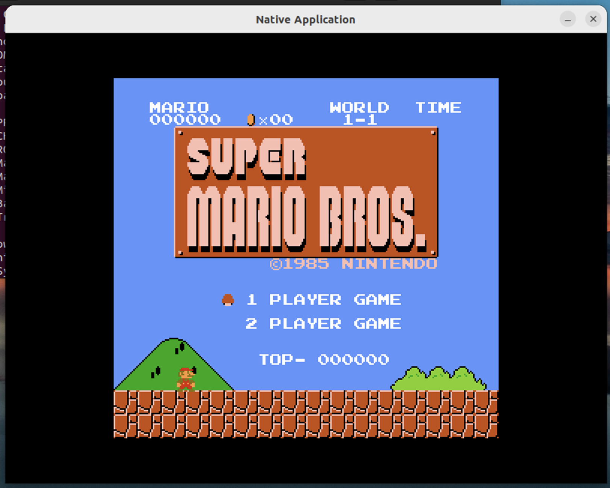

# 在开始愉快的PA之旅之前

✅ 运行超级玛丽



## NEMU 是什么

一款经过简化的全系统模拟器。NEMU的功能是负责模拟出一套计算机硬件, 让程序可以在其上运行.

```
                         +---------------------+  +---------------------+
                         |     Super Mario     |  |    "Hello World"    |
                         +---------------------+  +---------------------+
                         |    Simulated NES    |  |      Simulated      |
                         |       hardware      |  |       hardware      |
+---------------------+  +---------------------+  +---------------------+
|    "Hello World"    |  |     NES Emulator    |  |        NEMU         |
+---------------------+  +---------------------+  +---------------------+
|      GNU/Linux      |  |      GNU/Linux      |  |      GNU/Linux      |
+---------------------+  +---------------------+  +---------------------+
|    Real hardware    |  |    Real hardware    |  |    Real hardware    |
+---------------------+  +---------------------+  +---------------------+
          (a)                      (b)                     (c)
```


# RTFSC

NEMU主要由四个模块构成：monitor, CPU, memory, 设备

nemu 目录的源文件组织：

```
nemu
├── configs                    # 预先提供的一些配置文件
├── include                    # 存放全局使用的头文件
│   ├── common.h               # 公用的头文件
│   ├── config                 # 配置系统生成的头文件, 用于维护配置选项更新的时间戳
│   ├── cpu
│   │   ├── cpu.h
│   │   ├── decode.h           # 译码相关
│   │   ├── difftest.h
│   │   └── ifetch.h           # 取指相关
│   ├── debug.h                # 一些方便调试用的宏
│   ├── device                 # 设备相关
│   ├── difftest-def.h
│   ├── generated
│   │   └── autoconf.h         # 配置系统生成的头文件, 用于根据配置信息定义相关的宏
│   ├── isa.h                  # ISA相关
│   ├── macro.h                # 一些方便的宏定义
│   ├── memory                 # 访问内存相关
│   └── utils.h
├── Kconfig                    # 配置信息管理的规则
├── Makefile                   # Makefile构建脚本
├── README.md
├── resource                   # 一些辅助资源
├── scripts                    # Makefile构建脚本
│   ├── build.mk
│   ├── config.mk
│   ├── git.mk                 # git版本控制相关
│   └── native.mk
├── src                        # 源文件
│   ├── cpu
│   │   └── cpu-exec.c         # 指令执行的主循环
│   ├── device                 # 设备相关
│   ├── engine
│   │   └── interpreter        # 解释器的实现
│   ├── filelist.mk
│   ├── isa                    # ISA相关的实现
│   │   ├── mips32
│   │   ├── riscv32
│   │   ├── riscv64
│   │   └── x86
│   ├── memory                 # 内存访问的实现
│   ├── monitor
│   │   ├── monitor.c
│   │   └── sdb                # 简易调试器
│   │       ├── expr.c         # 表达式求值的实现
│   │       ├── sdb.c          # 简易调试器的命令处理
│   │       └── watchpoint.c   # 监视点的实现
│   ├── nemu-main.c            # 你知道的...
│   └── utils                  # 一些公共的功能
│       ├── log.c              # 日志文件相关
│       ├── rand.c
│       ├── state.c
│       └── timer.c
└── tools                      # 一些工具
    ├── fixdep                 # 依赖修复, 配合配置系统进行使用
    ├── gen-expr
    ├── kconfig                # 配置系统
    ├── kvm-diff
    ├── qemu-diff
    └── spike-diff
```

[NEMU ISA相关的API说明文档 | 官方文档](https://ysyx.oscc.cc/docs/ics-pa/nemu-isa-api.html#虚拟内存相关)

# 准备第一个客户程序

**nemu main**
- `init_monitor`
	- `parse_args` 解析参数 (nemu main传入)
	- `init_rand` 初始化随机数种子
	- `init_log` 打开日志文件
	- `init_mem` 初始化内存
	- `IFDEF(CONFIG_DEVICE, init_device())` 如果定义了 `CONFIG_DEVICE` 才会调用 `init_device`
	- `init_isa` 进行ISA初始化工作
		- `memcpy(guest_to_hoist(RESET_VECTOR), img)` 将内置的客户程序读入到内存中。guest_to_hose()函数完成地址映射
		- `restart()` 初始化寄存器。让pc跳转到RESET_VECTOR上，设置寄存器0为0
	- `init_isa()` 把客户程序从镜像文件加载到内存，覆盖内置客户程序。镜像文件由可选参数指定
	- `init_difftest`
	- `init_sdb`
	- `welcome` 显示欢迎信息
- `engine_start()`

✅ 移除报错代码

```c
  Log("Exercise: Please remove me in the source code and compile NEMU again.");
  assert(0);
```

# 运行第一个客户程序


- `engine_start()`
	- `sdb_mainloop()` 进入简易调试器的主循环
		- `cmd_c`  (识别到 `c` )
			- `cpu_exec(-1)`
				- `execute(n = -1)` (-1 无符号时最大值，定义无限循环的行为)
					- 调用 n 次 `exec_once` 
		- `cmd_q` (识别到 `q`)
			- 返回 -1

**三个对调试有用的宏**

- `Log` 专门用来输出调试信息
- `Assert()` 当测试条件为假时，在fail之前可以输出一些信息
- `panic()` 用于输出信息并结束程序

**内存**

内存通过在`nemu/src/memory/paddr.c`中定义的大数组`pmem`来模拟. 在客户程序运行的过程中, 总是使用`vaddr_read()`和`vaddr_write()` (在`nemu/src/memory/vaddr.c`中定义)来访问模拟的内存. vaddr, paddr分别代表虚拟地址和物理地址.

✅ 打开调试信息

.config 产生的不同：

```
38c38
< CONFIG_CC_DEBUG=y
---
> # CONFIG_CC_DEBUG is not set
```

makefile中

```
CFLAGS_BUILD += $(if $(CONFIG_CC_DEBUG),-Og -ggdb3,)
```

也就是说打开之后，会导致添加 `-Og, -ggdb3` 选项


## 优美的退出

> 优美地退出
> 
> 为了测试大家是否已经理解框架代码, 我们给大家设置一个练习: 如果在运行NEMU之后直接键入`q`退出, 你会发现终端输出了一些错误信息. 请分析这个错误信息是什么原因造成的, 然后尝试在NEMU中修复它.

在 `nemu/src/utils/state.c` 中

```c
int is_exit_status_bad() {
  int good = (nemu_state.state == NEMU_END && nemu_state.halt_ret == 0) ||
    (nemu_state.state == NEMU_QUIT);
  return !good;
}
```

输出后发现 

```
[src/utils/state.c:23 is_exit_status_bad] nemu_state = 1, nemu_state.halt_ret = 0
```

不满足条件，退出时需设置 nemu_state

```c
static int cmd_q(char *args) {
  nemu_state.state = NEMU_QUIT;
  return -1;
}
```

修改后正常退出

# 表达式求值


